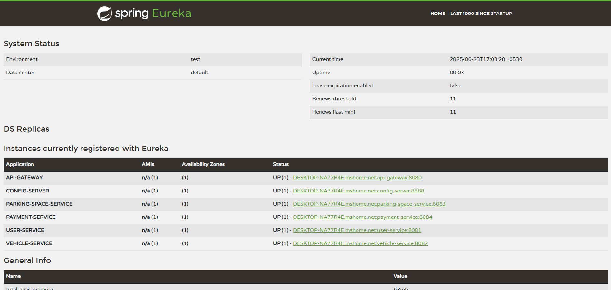
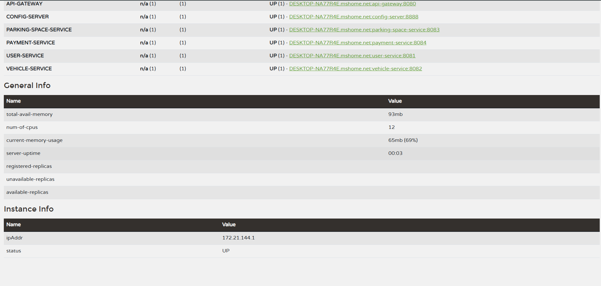

# 🚗 Smart Parking Management System

## 🎯 Overview

The **Smart Parking Management System (SPMS)** addresses urban parking challenges through intelligent space allocation and dynamic management. The platform enables drivers to locate and reserve parking spaces in real time, while providing parking space owners with tools for live monitoring, configuration, and secure payment processing.

---

## 🛠️ Infrastructure Services

- 🌐 **Eureka Server** – Service registry and discovery  
- ⚙️ **Config Server** – Centralized configuration management  
- 🚪 **API Gateway** – Request routing and load balancing

---

## 📋 Resources

- [📋 Postman Collection](./postman_collection.json)  
- 
- 

---

## 📁 Project Structure

AAD2-Final-Project/
├── 🌐 eureka-server/
├── ⚙️ config-server/
├── 🚪 api-gateway/
├── 🅿️ parking-space-service/
├── 🚙 vehicle-service/
├── 👤 user-service/
├── 💳 payment-service/
├── 📚 docs/
│ └── screenshots/
│ └── eureka_dashboard.png
├── 📋 postman_collection.json
└── README.md

---

## 💼 Business Services

- 🅿️ **Parking Space Service** – Space availability and reservation logic  
- 🚙 **Vehicle Service** – Vehicle registration, tracking, and entry/exit simulation  
- 👤 **User Service** – Authentication, profile management, and history  
- 💳 **Payment Service** – Mock payment validation and receipt generation

---

## 🧰 Tech Stack

**Spring Components Used:**
- Spring Boot
- Spring Cloud Config
- Spring Cloud Eureka
- Spring Cloud Gateway
- Spring Web

---

## 🚀 Setup & Run

**🔧 Prerequisites:**
- Java 11+
- Maven 3.6+

**Start Order:**
1. 🌐 Eureka Server – `http://localhost:8761`
2. ⚙️ Config Server – `http://localhost:8888`
3. 🅿️ 🚙 👤 💳 Business Services – `ports 8081 - 8084`
4. 🚪 API Gateway – `http://localhost:8080`

**✅ Verification:**
- Open Eureka Dashboard: [http://localhost:8761](http://localhost:8761)
- All services should be visible and registered

---

## ✨ Features

- 🔎 Real-time search for parking spaces
- 📡 Dynamic updates via manual or IoT status
- 💳 Secure payment simulation with digital receipts
- 🚗 Vehicle tracking and simulated entry/exit
- 📜 Booking history and user logs
- 📊 Zone-wise and owner-wise usage tracking

---

## 🧪 API Testing

- ✅ All endpoints validated with **Postman**
- 🔁 Verified service-to-service communication via API Gateway

---

## 👨‍💻 Author

**Dasun Wijayathilaka**  
📍 Colombo, Sri Lanka  
